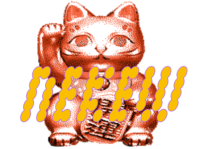

 

## nekew 
Nekew is a feline themed cli file encryption tool which uses libsodium's crypto secretstream encryption 
 
## how to build

### prerequisutes: 
- A working rust installation 
- A working installation of cc/clang for compiling libsodium and linking it to sodiumoxide 

this should work on all unix like os, I dont use windows so idk about that..... 

> inbetween changes atm so this may not compile at all ฅ(＾・ω・＾ฅ)
### compiling
``` 
 cargo build --bin nekew --color always --release
```
after this move the binary "nekew" from ``` /target/release ``` to ``` usr/bin ``` on linux or ``` usr/local/bin ``` on mac 
- if compilation fails first check that you actually have a working c compiler and rust installed
- if it still fails after this delete the target directory and recompile

as a little test of the program you can run this after compilation is done: 

``` 
./target/release/nekew --input bingus.gif.nekew --kill false --mode decrypt  --out ./  --sensitive 
``` 
and enter the password ```1234567890``` , use something better for your own files please

### usage 
``` 

            _                  
 _ __   ___| | _______      __  ／l、        
| '_ \ / _ \ |/ / _ \ \ /\ / /ﾞ（ﾟ､ ｡ ７ 
| | | |  __/   <  __/\ V  V /　 l、ﾞ ~ヽ  
|_| |_|\___|_|\_\___| \_/\_/　  じしf_, )ノ  
0.1.0
Xavier F. <https://github.com/Xavulu/nekew>
a feline themed file encryption app (=Φܫ Φ=)∫

USAGE:
    nekew [FLAGS] --input <FILE> --kill <TRUE/FALSE> --mode <ENCRYPT/DECRYPT> --out <DIR>

FLAGS:
    -h, --help         Prints help information
    -s, --sensitive    Use a better keygen for more sensitive data, memory intense
    -V, --version      Prints version information

OPTIONS:
    -i, --input <FILE>              takes in a file for encryption/decryption
    -k, --kill <TRUE/FALSE>         destroy the original file after encryption
    -m, --mode <ENCRYPT/DECRYPT>    choose to encrypt or decrypt a file
    -o, --out <DIR>                 output directory for file


``` 
